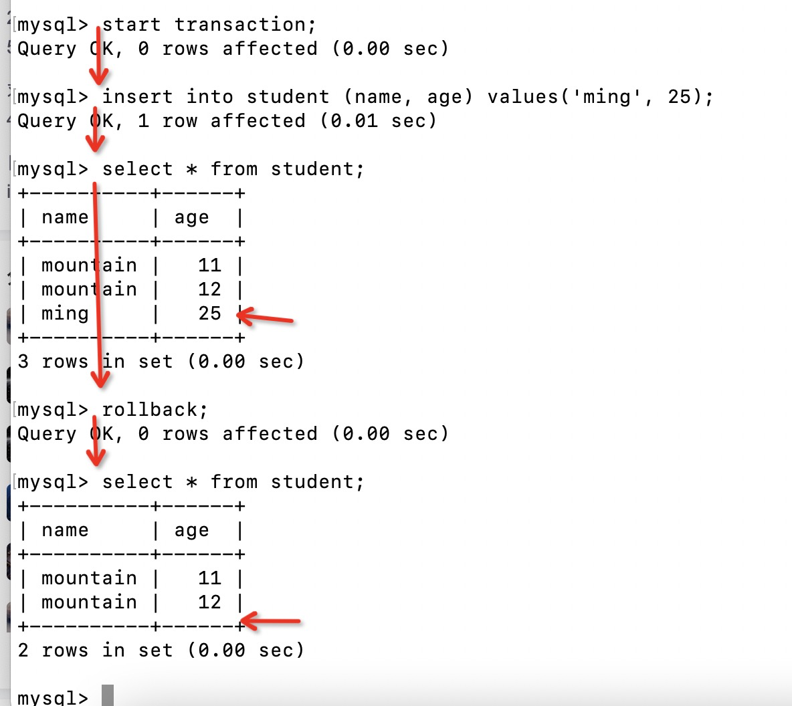
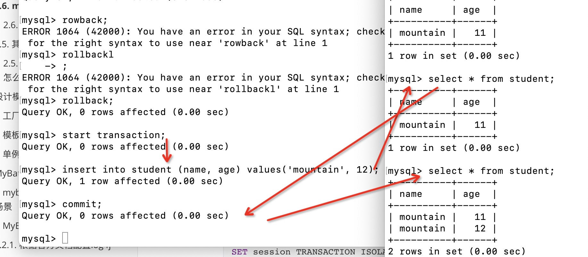

# Mysql知识梳理

## 1. 常见知识概念

### 1.1. mysql架构

- 连接池，授权，安全，链接处理
- 解析器，在此之前查缓存，若缓存已经有则不会过解析器，缓存直接返回
- 优化器
- 存储引擎：开启一个事物、根据主键提取一行记录

### 1.2. 一个查询语句执行顺序

- 客户端请求发起
- 查缓存，若缓存有直接返回结果集
- 过解析器，生成解析树
- 预处理器，生成解析树
- 优化器：重写查询、决定表的读取顺序、选择合适的索引
- 生成执行计划
- 存储引擎
- 数据层，筛选返回结果

### 1.3. 并发控制

​	多个进程在同一时刻修改或查询数据，顺序控制

#### 1.3.1. 服务器层

#### 1.3.2. 存储引擎层

#### 1.3.3. 读写锁

- 共享锁-读锁，共享互不阻塞【select】
- 排它锁-写锁，需要征用锁，获取锁的线程才可进行写操作【update, delete, insert】

#### 1.3.4. 锁粒度

​	所策略，在数据安全和执行效率上面寻找平衡点

- 表锁，整个表进行加锁，
- 行级锁-只在存储引擎层实现，例如innodb，xtradb

### 1.4. 事务

#### 1.4.1. 事务特性ACID

​	原子性、一致性、隔离性、持久性(durability)

- **Transaction**（整理事务隔离性笔记和传播性笔记）
  - **isolation**(非常重要)
  - **propagation**(非常重要，required和requied_new再主事务和嵌套事务中的使用及影响)
  - noRollbackFor/noRollbackForClassName/rollbackFor/rollbackForClassName
  - readOnly/Timeout
- 受检异常和未受检异常回滚机制
  - Transaction-readOnly/Timeout

#### 1.4.2. 事务隔离性级别及存在的问题

- 事务并发问题及处理对应情况

  - 脏读: 事务1修改了value，事务2独取了value，事务1回滚，这时候事务2独取到的值是脏数据
  - 幻读: 事务1读取了value，事务2修改了value，事务1再次独取value时两次独取不一致
  - 不可重复读: 两次独取到的数量不一致

  |                                         | 脏读 | 不可重复读 | 幻读 |
  | --------------------------------------- | ---- | ---------- | ---- |
  | READ_UNCOMMITTED(读未提交)              | 有   | 有         | 有   |
  | READ_COMMITTED(读已提交)                | 无   | 有         | 有   |
  | **REPEATABLE_READ(可重复读,mysql默认)** | 无   | 无         | 有   |
  | SERIALIZABLE(串行化)                    | 无   | 无         | 无   |

- 事务的传播性propagation

  - Propagation.REQUIRES_NEW 另起一个事务，该事务与主事务无关
  - Propagation.REQUIRED 和主事务绑定，若主事务执行异常则一同失败

#### 1.4.3. 死锁

​	两个或多个事务在统一资源互相占用，从而导致恶性循环的现象

- innodb目前处理死锁的方法是，将持有最少的行级排它锁的事务进行回滚

#### 1.4.4. 事务日志

- 提高事务的效率，使用事务日志，存储引擎在修改表的数据时只需要修改其内存拷贝，再把该修改行为记录到持久在磁盘硬件上，而不用每次都将修改的数据本身持久到磁盘（减少了io，保证有序性）- 预写式日志，修改数据需要写两次磁盘。
- 系统奔溃时，事务日志在系统恢复后会自动写入。

#### 1.4.5. 事务默认提交

- show variables like 'autocommit'; 查询事务是否默认提交；
- DDL - data definition language 数据定义语言 create、drop、alter改变或创建表结构
- 同一个事务只有在同一个存储引擎下才能保证被正常acid，多个存储引擎不可靠。

#### 1.4.6. 事务管理(105课)

- 查询默认隔离级别

  ```sql
  SELECT @@transaction_isolation;
  ```

- 修改当前session(glabal)的事务隔离级别

  - Read uncommitted

    

  - read committed

  - Repeatable read

    

  - Serializable

  ```sql
  SET session TRANSACTION ISOLATION LEVEL Serializable;
  ```

- 根据事务隔离级别进行测试提交及回滚操作

### 1.5. 多版本控制-MVC(currency)C	

​	**可认为mvcc时行级锁的一个变种【一种支持更好并发的锁机制】，而锁机制是为了支持并发事务而存在的**。但是他在很多情况下避免了加锁操作，因此开销更低，大都实现了非阻塞的读操作，写操作也只是锁定必要的行。

​	innodb的mvcc时通过在每行记录后面保存两个隐藏的列来实现的，这两个列，一个保存了行的创建时间，一个保存了行的过期时间。存储的时间意思是版本号，每开始一个新的事务，系统版本号都会自动递增，事务开始时刻的系统版本号会做为事务的版本号，用来和查询到的每行记录的版本号进行比较，因为有了版本号的控制，使得大多数读操作都可以不用加锁，不足之处是额外增加了存储空间。

- mvcc只会在读已提交和可重复读下生效，因为读未提交会每次都会读取最新的行，而不是符合当前事务版本的数据行，串行化会每次读取的行进行加锁

## 2. 基准测试

## 3. 服务器性能剖析

## 4. schema与数据类型优化

## 5. 高性能索引

## 6. 查询性能优化

## 7. 高级特性

## 问题汇总

### 4. schema数据类型与优化

#### 1. 索引为什么不建议为null

- 可谓null的列，被索引的时候需要多增加一个字节来存储，浪费空间
- 索引具有排序、分组、范围比较的功能，null不支持类似的场景

#### 2. 字段的设计原则

- 更小的通常更好
- 能简单的尽量简单，例如能用int解决的就不用char或者varchar
- 尽量避免null

#### 3. int(5)和int(3)的区别

- 无论从存储还是计算的时候没有区别，都是int类型
- 但是展示的时候，如果打开了ZF（zero fill）的标志位，如果是123的话，int（5）展示 00123 ，如果int（3）展示123，也就是不足位数的部分会被0填充

#### 4. 浮点数类型与decimal类型区别

- 浮点数是在cpu底层直接计算的，一般来说性能更高，能用浮点数尽量用浮点数，double为8字节，float为四个字节，decimal(18, 9) 为 9个字节，小数点前4个字节，小数点后4个字节，小数点为一个字节
- decimal类型用于财务数据的精准计算

#### 5. timestamp和datetime类型区别

- timestamp支持按照时区切换，存储的空间为datetime的一半，时间范围是1970-01-01 开始的
- datetime存储的时间范围比timestamp更广，范围从1001-9999
- 拓展：可以使用bigdecimal的类型类存储微秒数

#### 6. varchar和char区别

- varchar在默认情况下是可变长度的，当然可以通过row_format=fix来设置成固定长度
- char是存储固定长度的，且会忽略字符串的空格字符部分，例如：'  aaa  '=>'  aaa'，而varchar则不会

#### 7. blob和text类型说明

- blob使用的是二进制存储
- text是用的是字符串存储，有字符集和排序规则

#### 8. bit类型

```sql
create table A (value bit(10));
insert into A (value) values(57);
select a, a+0, a+'123';
-- 输出结果 57的二进制，9，9123
```

#### 9. mysql六种范式的前三种

第一范式：列具有原子性，不可再分，一个字段只存储一个信息，避免使用substring函数之类的

第二范式：每个行记录需要能被唯一识别，通常就叫主键

第三范式：一个在数据库中不包含在其他表中已包含的非主键字段（拆分关联，外联，避免反范式）

#### 10. 范式与反范式的优点

- 范式
  - 更新操作通常比反范式要快
  - 只有很少或者没有重复的数据，所以只需要修改更少的数据
  - 范式化的表通常更小，执行更快
- 反范式
  - 因为数据都在一个表里面，可以很好的避免关联
  - 避免了关联产生的I/O
  - 单独的表也能使用更有效的索引策略

#### 11. 表重建的概念是什么？

- 操作表alter table 的时候，数据重新按照规范全部读出后再写入

#### 12. chage/alter/modify column的区别

```sql
alter table film
modify column rental_duration tinyint(3) not null default 5;
-- 这个执行更快，直接修改的。frm文件，而不涉及表的数据，不需要表重建
alter table film
alter column rental_duration set default 5;
```

### 5. 索引

#### 1. B-tree索引特性

​	innodb使用的是B+TREE索引

- 支持多个列的组合索引，也可是单列，遵循最左前匹配原则，不支持列表达式索引（where id + 1= 5）

- 若不考虑排序，尽可能的将组合索引中区别度较大的放在比较靠前的位置

- 存储的数据结构是有序的，因此在排序的时候效率高

- 根节点到叶子页的距离大都差不多，使用的是索引的值，区别覆盖索引若有唯一索引会使用唯一索引，否则自己会启一个隐式的列作为覆盖索引的列（innodb）

- 若查询使用的是组合方式，建议使用组合索引，虽然在mysql 5.1版本以后有对单独的列进行优化（explain 查询语句可以使用type: index_merge），但是其行能还是不如组合索引好，且or一般会使用补集的方式，建议修改成例如：

  ```sql
  select name from student where id=5 or id=6;
  -- 优化后
  select name from student where id=5 
  union all 
  select name from student where id=6
  ```

- 若索引列覆盖了要查询的内容则可以避免回表操作，性能会很高

#### 2. 哈希索引

- 存储结构是键值对的方式，可以想象成一个hash表的值对应的行索引，没有存储行数据，因此必须回表操作

- 行数据唯一的区别索引，当hash冲突特别低的时候查询行能特别高，若有hash冲突则会先找到对应的hash行，根据实际进行比较

  ```sql
  select grade from student where name=crc32(name) and name='mountain';
  ```

- 是无序的，因为hash值本身就是无序的

#### 3. CRC32、SHA、MD5、FNV64对哈希索引的影响

- 通常crc32可适用，因为长度相对较短，但是在数据量大，hash冲突明显可使用内置的fnv64进行编码以尽可能解决hash冲突
- sha和md5加密后字符串一般比较长，比较不适用索引行能的提高，因为储存和需要比较的空间变大了

#### 4. 空间索引

- 可以针对建立索引的列进行搜索，例如地理位置的索引

#### 5. 全文索引

- 可以通过关键字进行查找的索引
- 一般来说，在列中出现频率较高的关键词，其索引的的优先级越低

#### 6. 索引好处与高性能索引

- 索引列若是一个表达式则无效

- 列区分度越高的最好放到越靠前的位置

- 对于列的字符串区别比较大的，可使用列的的前几个字符串建立索引，若反转后区别度比较大，可以将字符串反转后，建立字符串的索引（例如：邮箱）

- 表优化建议：

  - 若要统计访问次数，并发针对一个列修改比较大，则可以使用多个行同时记录并发的数量，通过多个行随机轮询的形式以减少行级锁

  - 可使用缓存表或者临时表，快照对数据进行优化

#### 7. 三星索引

- 一星索引：索引相关记录放到一起
- 二星索引：具有数据排序和查找中的顺序排列一致
- 三星索引：索引覆盖了要查找了行，避免了回表操作

#### 8. 聚簇索引

- 数据行和相邻的键值紧凑的储存在一起，节点页（B-TREE索引）对应叶子也（数据行）的一种存储方式

- 优点：

  - 索引条目通常远小于数据行大小，所以如果只是需要独取索引，那mysql就会极大的减少数据访问量

  - 因为索引是按照列值顺序存储的（每个页内），所以对于I/O密集型的应用也有帮助

    说明：innodb引擎获取数据的时候，是尽可能获取页内的数据传输到服务器进行筛选后返回的，这部分数据会在内存中，所以获取的数据集可直接从内存中获取，而不用再次操作存储引擎获取数据

  - 由于innodb的聚簇索引，覆盖索引对innodb表特表有用，innodb的二级索引在叶子节点中保存了行的主键值，所以如果二级主键能够覆盖查询，则可以避免对主键索引的二级查询（若是不能覆盖则顺序如下：二级索引->主键->数据行，这时候查询的是两次操作，而不是一次，会徒增不必要的io，这是一个很大的缺陷）

- 缺点：

  - 数据页内的数据是保持有序的，因此插入的时候会相对无序的慢一点
  - 数据页每页的大小容量是固定的，若删除当前页的数据比较多，此时会产生较多的数据碎片
  - 当插入的数据的时候，有于数据页已经满了，因此可能产生页分裂的情况

#### 10. 覆盖索引

- 不需要回表操作，可直接返回索引列对应的数据结果，效率很高

### 99. mysql实战优化

#### 1. 一条sql执行的过程

- 从线程驱动连接、连接池、sql被获取、解析、优化、执行(三种日志的读写和同步)、存储引擎、读写磁盘。。。。

#### 2. binlog和redo log

- 使用场景
- 各自特点
- 读写、保存、恢复方式

#### 3. 常用的基准测试指标

- TPS、QPS、
- 吞吐量：机器的磁盘存储每秒可以读写多少字节的数据量
- IOPS：机器的随机ip并发能力
- latency：往磁盘写入一条数据的延时
- 带宽、cup、内存

#### 4. 缓存池buffer pool

- 作用/定义：缓存了磁盘的真是数据，对数据库的增删改操作其实就是对缓存的增删改
- 手动分配修改buffer pool大小
- 读取磁盘页数据（最小单位）入缓存页中(16KB)，并添加缓存页的数据描述（大小为缓存页的5%，800字节；数据的表，磁盘所在的位置，数据页的位置）

#### 5. 缓存池的free链表

- 用于记录缓存池中未被使用的缓存页信息，存储的数据块描述

- 一个双向链表的指针链，

  ```
  pre 数据块描述1 next  pre 数据块描述2 next ... null 
  ```

- 缓存的链表都是置于buffer pool中的，但有一个free的基础节点，40KB左右，用于记录链表的头节点和尾节点的地址信息以及当前又多少个字节

#### 6. 读取数据页入缓存页的过程

- 先获取free链表的一个数据描述块
- 读取磁盘数据页入缓存页中，并在数据描述块上添加对应的缓存页、数据页的信息（包含了表空间、页位置等信息，表空间和页位置信息通过hash算法后行成一个缓存表，用于缓存）

#### 7. 如何从free链表移除数据描述块

- 一个类似指针的操作，pop操作

#### 8. flush链表

- 用于记录被修改的脏页缓存链表，只有增删改才会产生脏数据，此时的缓存页也被叫做脏页
- 是类似free链表的双向指针结构

#### 9. 缓存不够淘汰原则 LRU

- 使用LRU算法，使用缓存命中率来淘汰使用最少的缓存页，将其写入磁盘
- 并从LRU链表中释放对应的缓存页索引信息

#### 10. LRU与预读取的矛盾

- 有于数据库的预读取策略，根据LRU原则，去掉最近最少使用LRU链表尾部的缓存页，但是此时最近最少使用的应该是预读取的缓存页
  - mysql出发预读取的策略
    - 顺序访问了一个区里面多个数据也，访问的数据也超过了innodb_read_ahead_threshold的默认值56，默认off
    - 如果buffer pool缓存了一个区里的13个连续的数据也，而且这些页数具都是比较频繁的访问，此时就会直接触发预读机制，把这个区里面的其他数据页都加载到缓存中去，通过innodb_random_read_ahead控制，默认off
- 全表扫描会扫入大量的无用数据导致缓存也占满，缓存失效

#### 11. LRU链表的冷热数据分离思想

- 解决了上述LRU导致的缓存失效问题
- 通过提供再LRU上划分冷数据和热数据行成的链表，若读取的数据页和预读取的数据也，都会被放在LRU链表冷数据的头部，冷数据在加载到缓存页1s后，被访问，则这个缓存页会被移动到LRU链表的头部，变成热数据


## 知识补充

### 1. innodb和MyISAM存储引擎区别

- innodb索引可采用表锁，行级锁而MyISAM没有行级锁，只有表锁，支持
- InnoDB支持事物，而MyISAM不支持事物
- InnoDB支持MVCC, 而MyISAM不支持
- InnoDB支持外键，而MyISAM不支持
- InnoDB不支持全文索引，而MyISAM支持。

### 2. Mysql常用查询

#### 1. 查询表情况

```sql
show table status like 'student';
```

#### 2. 事务

- 查询隔离级别

```sql
select @@transaction_isolation
```

- 设置当前事务隔离级别

```sql
set transaction session isolation level read committed;
```

#### 3. 性能查询

- 执行查询性能

```sql
explain select 
```

- 

#### 4. 修改表的存储引擎

```sql
alter table tablename set engine=InnoDB
```


